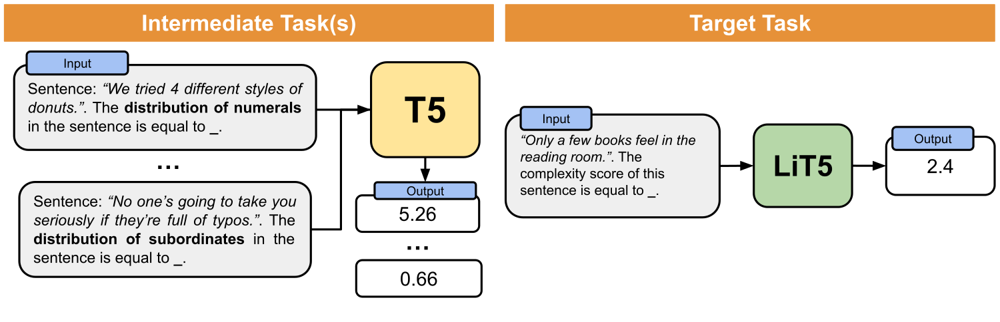

# Linguistic Knowledge Can Enhance Encoder-Decoder Models (*If You Let It*)

<p align="center">
    
</p>


This repository contains data and models associated to the LREC-COLING 2024 paper "Linguistic Knowledge Can Enhance Encoder-Decoder Models (*If You Let It*)". If you use any of the following contents for your work, we kindly ask you to cite our paper:

```bibtex
@inproceedings{miaschi_linguistic_knowledge,
    title = "Linguistic Knowledge Can Enhance Encoder-Deocer Models (If You Let It)",
    author = "Miaschi, Alessio and Dell'Orletta Felice and Venturi, Giulia",
}
```

> **Abstract:** In this paper, we explore the impact of augmenting pre-trained Encoder-Decoder models, specifically T5, with linguistic knowledge for the prediction of a target task. In particular, we investigate whether fine-tuning a T5 model on an intermediate task that predicts structural linguistic properties of sentences modifies its performance in the target task of predicting sentence-level complexity. Our study encompasses diverse experiments conducted on Italian and English datasets, employing both monolingual and multilingual T5 models at various sizes. Results obtained for both languages and in cross-lingual configurations show that linguistically motivated intermediate fine-tuning has generally a positive impact on target task performance, especially when applied to smaller models and in scenarios with limited data availability.

## Dataset

The respository is structured in two main folders:

- **intermediate_tasks_data** - Contains the datasets for the intermediate-tasks both for the Italian and English languages.

- **complexity_data** - Contains the datasets for the target task (i.e. complexity score prediction) both for the Italian and English languages.


The datasets in the ```intermediate_tasks_data``` folder are structured in training and test data. Each file contains one instance per row, with the following information:

- *id*: id of the sentence.

- *sentence*: the raw text.

- *label*: the label (i.e. the linguistic feature) associated with the sentence for that specific linguistic property.

- *feature*: the name of the linguistic property.

The datasets in the ```complexity_data``` folder are structured in training and test data. The training data is further split into 5 bins containing an increasing number of sentences and balanced for the six sentence lengths. Each file contains one instance per row, with the following information:

- *id*: id of the sentence.

- *sentence*: the raw text.

- *label*: the label (i.e. average complexity score) associated with the sentence.

The target task dataset is based on the corpus introduced in ["Is this Sentence Difficult? Do you agree?"](https://aclanthology.org/D18-1289.pdf) (Brunato et al., 2018). Please also cite this work if you use the dataset in your work:

```bibtex
@inproceedings{brunato-etal-2018-sentence,
    title = "Is this Sentence Difficult? Do you Agree?",
    author = "Brunato, Dominique  and
      De Mattei, Lorenzo  and
      Dell{'}Orletta, Felice  and
      Iavarone, Benedetta  and
      Venturi, Giulia",
    editor = "Riloff, Ellen  and
      Chiang, David  and
      Hockenmaier, Julia  and
      Tsujii, Jun{'}ichi",
    booktitle = "Proceedings of the 2018 Conference on Empirical Methods in Natural Language Processing",
    month = oct # "-" # nov,
    year = "2018",
    address = "Brussels, Belgium",
    publisher = "Association for Computational Linguistics",
    url = "https://aclanthology.org/D18-1289",
    doi = "10.18653/v1/D18-1289",
    pages = "2690--2699",
}
```


## Models

The T5 models fine-tuned on the intermediate tasks, i.e. the LiT5 models, can be accessed via [🤗 Huggingface Model Hub](https://huggingface.co/docs/hub/models-the-hub). The following fine-tuned models are available:

- **[Li-iT5-small](https://huggingface.co/alemiaschi/li-it5-small)** - Small Italian T5 (6+6 layers, 60M parameters) fine-tuned on the 10 selected linguistic properties.
- **[Li-iT5-base](https://huggingface.co/alemiaschi/li-it5-base)** - Base Italian T5 (12+12 layers, 220M parameters) fine-tuned on the 10 selected linguistic properties.
- **Li-iT5-large** - Large Italian T5 (24+24 layers, 738M parameters) fine-tuned on the 10 selected linguistic properties.
- **[LiT5-small](https://huggingface.co/alemiaschi/lit5-small)** - Small English T5 (6+6 layers, 60M parameters) fine-tuned on the 10 selected linguistic properties.
- **LiT5-base** - Base English T5 (12+12 layers, 220M parameters) fine-tuned on the 10 selected linguistic properties.
- **LiT5-large** - Large English T5 (24+24 layers, 770M parameters) fine-tuned on the 10 selected linguistic properties.
