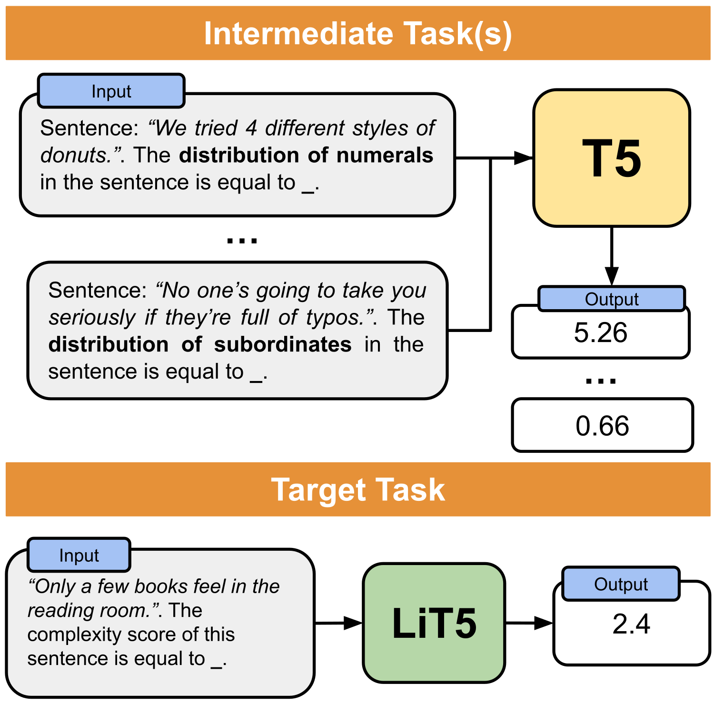

# Linguistic Knowledge Can Enhance Encoder-Decoder Models (*If You Let It*)

<p align="center">
    
</p>


This repository contains data and models associated to the paper "Linguistic Knowledge Can Enhance Encoder-Decoder Models (*If You Let It*)". If you use any of the following contents for your work, we kindly ask you to cite our paper:

```bibtex
@inproceedings{miaschi_linguistic_knowledge,
    title = "Linguistic Knowledge Can Enhance Encoder-Deocer Models (If You Let It)",
    author = "Miaschi, Alessio and Dell'Orletta Felice and Venturi, Giulia",
}
```

## Dataset

The respository is structured in two main folders:

- **intermediate_tasks_data** - Contains the datasets for the intermediate-tasks both for the Italian and English languages.

- **complexity_data** - Contains the datasets for the target task (i.e. complexity score prediction) both for the Italian and English languages.


The datasets in the ```intermediate_tasks_data``` folder are structured in training and test data. Each file contains one instance per row, with the following information:

- *id*: id of the sentence.

- *sentence*: the raw text.

- *label*: the label (i.e. the linguistic feature) associated with the sentence for that specific linguistic property.

- *feature*: the name of the linguistic property.

The datasets in the ```complexity_data``` folder are structured in training and test data. The training data is further split into 5 bins containing an increasing number of sentences and balanced for the six sentence lengths. Each file contains one instance per row, with the following information:

- *id*: id of the sentence.

- *sentence*: the raw text.

- *label*: the label (i.e. average complexity score) associated with the sentence.

## Models

The T5 models fine-tuned on the intermediate tasks, i.e. the LiT5 models, can be accessed via [🤗 Huggingface Model Hub](https://huggingface.co/docs/hub/models-the-hub). The following fine-tuned models are available:

- **[Li-iT5-small](https://huggingface.co/alemiaschi/li-it5-small)** - Small Italian T5 (6+6 layers, 60M parameters) fine-tuned on the 10 selected linguistic properties.
- **[Li-iT5-base](https://huggingface.co/alemiaschi/li-it5-base)** - Base Italian T5 (12+12 layers, 220M parameters) fine-tuned on the 10 selected linguistic properties.
